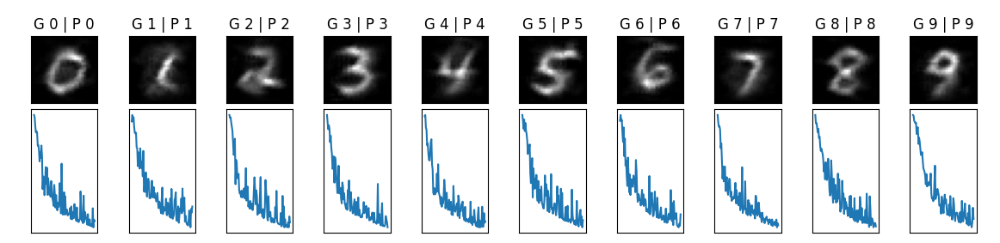

# Use Classifier as Generator

Haoyang Li, Fall 2021, Organized Sep 23th, 2022

This is the repository for the following preprint: https://arxiv.org/abs/2209.09210

And this paper is a course final project for Cornell CS 6670 in Fall 2021.

## Basic Idea

Treat the classifier as a conditional probability estimator and conduct a maximum likelihood estimation:

$$
\begin{align}
\hat{x} &= {\arg\max}_{x\in\mathcal{X}} p(x,y) \\
    &={\arg\max}_{x\in\mathcal{X}} p(y|x)p(x)\\
    &\approx {\arg\max}_{x\in\mathcal{X}}f(x)_y p(x)\\
    &={\arg\max}_{x\in\mathcal{X}}\log {f(x)}_y + \log{p(x)}\\
    &={\arg\min}_{x\in\mathcal{X}}\mathcal{L}_1(f(x),y) + \mathcal{L}_2 (x)
    \end{align}
$$

## Demo

Generating ten digit images:

</img>

The first row shows the generated images, with title like G 0 | P 0 means it is generated for class 0 and got predicted as class 0. The second row shows the corresponding trending of losses.

## Run it

Install all requirements:

```python3
pip install -r requirements.txt
```

Generate images of all 10 classes:

```python3
python gen_all.py
```

## Citation

If you use this code or develop based on this code, please cite:

```latex
@misc{https://doi.org/10.48550/arxiv.2209.09210,
  doi = {10.48550/ARXIV.2209.09210},
  url = {https://arxiv.org/abs/2209.09210},
  author = {Li, Haoyang},
  keywords = {Computer Vision and Pattern Recognition (cs.CV), FOS: Computer and information sciences, FOS: Computer and information sciences},
  title = {Use Classifier as Generator},
  publisher = {arXiv},
  year = {2022},
  copyright = {Creative Commons Attribution Non Commercial Share Alike 4.0 International}
}
```

